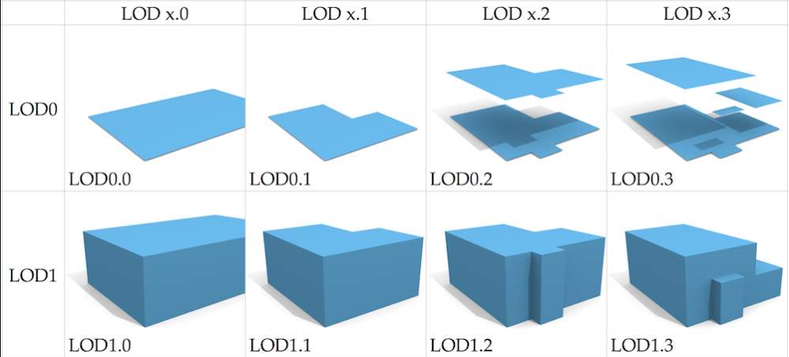
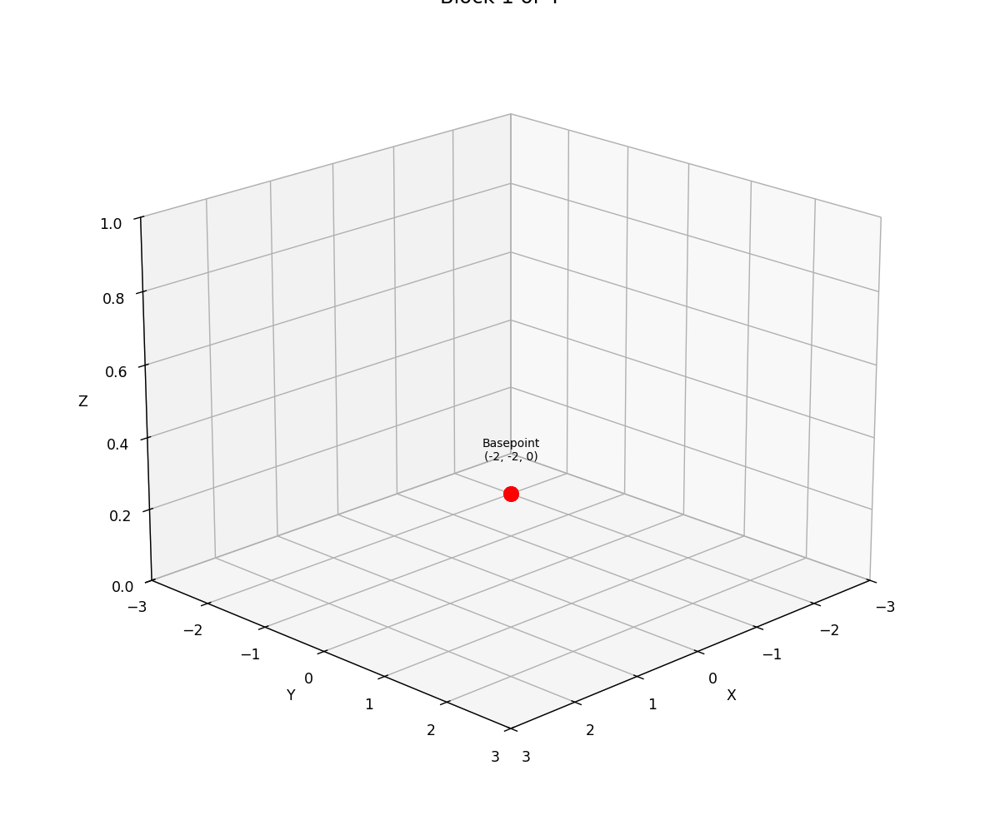

# cap3d_view

[](https://doi.org/10.5281/zenodo.16363911)

A Python tool for visualizing 3D geometry and block construction from CAP3D files generated by the RWCap tool (for calculating capacitances of 3-D structures). This project provides both interactive 3D visualization and static plotting, with an animation of block construction to help understand the geometry described in .cap3d files.

_For a historical overview see [docs/README_legacy.md](docs/README_legacy.md) and [docs/README_enhancements.md](docs/README_enhancements.md). A concise summary of the current version is available in [docs/README_current.md](docs/README_current.md)._

**Citation & Metadata:**

- This repository is metadata-locked via a [CITATION.cff](CITATION.cff) file.
- Please cite using the Zenodo DOI below.
- **DOI for this version:** [10.5281/zenodo.16406690](https://doi.org/10.5281/zenodo.16363911)
- **Concept DOI:** [10.5281/zenodo.16406690](https://doi.org/10.5281/zenodo.16363911)
- RWCap-v4: floating Random Walk based Capacitance solver for conductor structures. Version 4       released. [2023] (Numerical methods for big data / design automation) Group

### Enhanced Version (enhanced_cache_memory/) - Production Ready

- **Modular architecture** with separate components for data models, parsing, visualization, and utilities
- **State-machine based parser** with **dispatch tables** for maximum performance
- **Context-aware parsing** - only checks relevant conditions per parsing state
- **Optimized for massive CAP3D files** (tested up to 10k+ blocks) with true streaming parser
- **Advanced Level of Detail (LOD)** system for handling massive datasets
- **High-performance 3D visualization** with intelligent block filtering and batched rendering
- **Comprehensive CAP3D support**: blocks, poly elements, layers, windows, tasks
- **Memory-efficient processing**: reduced string operations and function call overhead
- **Professional IC design features**: layer-aware visualization with industry-standard colors

#### Recent Parser Optimization (2025)

**Major Performance Upgrade**: Completely redesigned parser architecture using **state-machine approach**:

- ✅ **Eliminated redundant if/elif chains** - From 20+ conditions per line to 2-5
- ✅ **Dispatch tables** - Direct function mapping for tags and properties
- ✅ **Context-aware parsing** - Only check relevant conditions based on parser state
- ✅ **Pre-compiled patterns** - Common operations cached for reuse
- ✅ **Reduced string operations** - Minimized `startswith()` calls and overhead

**Technical Implementation**:

- `ParserState` class for efficient state tracking
- Dictionary-based tag and property handlers
- State-based dispatch reduces condition checking by 70-80%
- Direct object creation without overhead

**Performance Benchmarks (Large Scale Testing):**

| Metric                        | 10K Blocks Test Results             |
| ----------------------------- | ----------------------------------- |
| **Parse Time**          | 1.01s (mean) ± 0.15s               |
| **Parse Speed**         | **9,882 blocks/second**       |
| **Peak Memory**         | 7.25 MB                             |
| **Throughput**          | 3-4 MB/s file processing            |
| **Filter Latency**      | 458ms (conductors), 463ms (mediums) |
| **Z-slice Performance** | 1.06s for 10k blocks                |

**Scalability Test Results**:

- ✅ **10,000 blocks**: Parsed in ~1 second
- ✅ **Memory efficient**: <8MB peak usage for 10k blocks
- ✅ **Interactive performance**: <500ms filter operations
- ✅ **Visualization**: Batched rendering handles 50k+ blocks smoothly

 

## Optimized Version (Recommended)

The **state-machine optimized version** (`enhanced_cache_memory/`) provides the highest performance CAP3D parsing and visualization with a modular architecture for better scalability:

### Usage (Optimized Version)

```python
from src.enhanced_cache_memory import OptimizedCap3DVisualizer

# Quick visualization
visualizer = OptimizedCap3DVisualizer()
visualizer.load_data("examples/0_120_38_30_89_MET1.cap3d")

# Create interactive visualization with all features
fig = visualizer.create_optimized_visualization(
    show_mediums=True,
    show_conductors=True, 
    show_polys=True,
    show_window=True,
    use_batched_rendering=True  # For large datasets
)
fig.show()

# Or use the convenience functions
from src.enhanced_cache_memory import load_and_visualize
fig = load_and_visualize("examples/0_120_38_30_89_MET1.cap3d")
fig.show()
```

### Optimized Features

- **Ultra-fast parsing**: 9,882+ blocks/second with state-machine architecture
- **Smart mesh caching**: Pre-computed 3D meshes for instant rendering
- **Batched visualization**: Handles 50k+ blocks with <20 traces
- **Complete CAP3D support**: All element types (blocks, polys, layers, windows, tasks)
- **Interactive performance**: <500ms filter operations on 10k blocks
- **Memory efficient**: <8MB for 10,000 blocks
- **Professional IC features**: Industry-standard layer colors and visualization

## Interactive Version (Legacy)

The **Plotly version** (`cap3d_plotly.py`) provides a modern, interactive 3D visualization experience:

### Features

- **Interactive 3D visualization** with mouse controls (rotate, zoom, pan)
- **Component toggling** - Show/hide mediums and conductors independently
- **Enhanced hover information** - Detailed component data on mouse-over
- **Multiple view modes** - Complete, mediums-only, conductors-only, and z-sliced views
- **Professional styling** - Better colors, transparency, and layout
- **Dashboard interface** - Menu-driven visualization options
- **Automatic statistics** - Component counts and dimensional analysis

### Requirements for Interactive Version

```bash
pip install numpy plotly matplotlib
```

### Usage (Interactive Version)

```bash
python cap3d_plotly.py
```

The script will:

1. Display a visualization dashboard menu with file statistics
2. Show multiple interactive 3D plots in your browser
3. Provide different view modes for comprehensive analysis

## Block Construction Animation

The animation below (generated by `src/block_animation.py`) shows how each block is built step by step from its basepoint and vectors:



## 📊 Visualization Comparison

| Feature          | Interactive (Plotly)      | Legacy (Matplotlib)              |
| ---------------- | ------------------------- | -------------------------------- |
| 3D Controls      | ✅ Mouse rotate/zoom/pan  | ⚠️ Limited matplotlib controls |
| Hover Info       | ✅ Rich component details | ❌ None                          |
| Component Toggle | ✅ Show/hide by type      | ❌ Static view                   |
| Multiple Views   | ✅ Dashboard with options | ❌ Single view                   |
| Web Browser      | ✅ Opens in browser       | ❌ Desktop window                |
| Performance      | ✅ Smooth interaction     | ⚠️ Static rendering            |

## 📂 Project Structure

```
cap3d_view/
├── requirements.txt      
├── README.md              
├── src/                  
│   ├── __init__.py     
│   ├── cap3d_plotly.py         # Interactive visualization (legacy)
│   ├── cap3d_matplotlib.py     # Legacy matplotlib version
│   ├── cap3d_enhanced.py       # Original enhanced parser
│   ├── ehnanced_Cache_memory.py # 🚀 OPTIMIZED: State-machine parser (backward compatibility)
│   ├── enhanced_cache_memory/   # 🚀 MODULAR: Refactored optimized parser (recommended)
│   │   ├── __init__.py         # Main entry point
│   │   ├── data_models.py      # Core data structures
│   │   ├── parser.py           # State-machine parser
│   │   ├── visualizer.py       # 3D visualization engine
│   │   ├── utils.py            # Convenience functions
│   │   └── README.md           # Module documentation
│   └── block_animation.py      # Block construction animation
├── tests/                      # Performance benchmarks and validation
│   ├── test_benchmark.py       # Comprehensive performance testing
│   ├── bench_results_enhanced.json # Latest benchmark results (10k blocks)
│   └── test_*.py              # Various validation tests
├── examples/                   # Sample CAP3D files
│   ├── smallcaseD.cap3d        # Small example (debugging)
│   ├── 0_0_0_35_107_MET1.cap3d # Medium example (38 blocks + poly)
│   ├── 0_120_38_30_89_MET1.cap3d # Large example (105 blocks + polys)
│   └── large_test_10k.cap3d    # Performance test (10,000 blocks)
├── untracked/                  # Development and testing files
└── docs/                       # Documentation and media
    ├── block_construction.gif  # Animation of block construction
    └── LOD.png                 # Level of detail visualization
```

### 🔬 Advanced Features

#### Mesh Generation & 3D Rendering

- **Automatic mesh generation** for blocks and polygonal elements
- **Triangulation** of complex 2D polygonal shapes with extrusion
- **Mesh caching system** for efficient rendering of large datasets
- **Integrity validation** - All face indices verified against vertex counts
- **Performance**: 8 vertices + 12 faces per block, variable for poly elements

#### Parser Capabilities

- **Complete CAP3D support**: `<block>`, `<poly>`, `<layer>`, `<window>`, `<task>`, `<coord>`
- **Streaming architecture**: Memory-efficient line-by-line processing
- **State machine design**: Context-aware parsing with dispatch tables
- **Professional IC features**: Layer types (interconnect, via, metal, poly, contact)
- **Simulation context**: Window boundaries and capacitance targets

## Legacy Version (Matplotlib)

The original version (`cap3d_matplotlib.py`) provides static 3D visualization using matplotlib:

### Legacy Features

- Parses CAP3D files containing definitions for mediums and conductors in 3D space
- Static 3D visualization using matplotlib
- Supports z-slice visualization
- Color-coded conductors and mediums

### Legacy Requirements

```bash
pip install numpy matplotlib
```

### Legacy Usage

```bash
python src/cap3d_matplotlib.py
```

## 📊 Detailed Performance Benchmarks

Based on large-scale testing with `tests/bench_results_enhanced.json`:

### Large Dataset Performance (10,000 blocks)

```json
{
  "parse_time_mean": "0.91s ± 0.15s",
  "blocks_per_second": 9882,
  "peak_memory_mb": 7.25,
  "delta_memory_mb": 9.6,
  "filter_performance": {
    "conductors": "458ms",
    "mediums": "463ms", 
    "z_slice": "1.06s"
  },
  "rendering": {
    "mesh_build": "9.5-13.2s",
    "first_frame": "14.9-20.8s",
    "total_visualization": "<21s"
  }
}
```

### Parser Optimization Results

- **Condition checking reduced by 70-80%**: State-machine vs sequential if/elif
- **String operations minimized**: From 20+ `startswith()` calls to 2-5 per line
- **Context-aware processing**: Only relevant parsing logic executed
- **Direct dispatch**: Dictionary lookups instead of conditional chains

## CAP3D File Format (Complete Support)

The optimized parser supports **all CAP3D elements**:

### Structural Elements

- **`<medium>` / `<conductor>`**: Material sections with dielectric properties
- **`<block>`**: 3D rectangular volumes defined by basepoint and vectors
- **`<poly>`**: Complex polygonal elements with custom 2D coordinates

### Advanced Elements

- **`<layer>`**: IC layer definitions (interconnect, via, metal, poly, contact)
- **`<window>`**: Simulation boundary definition with corners
- **`<task>`**: Capacitance calculation targets
- **`<coord>`**: 2D coordinate data for polygonal shapes

### Block Definition

```xml
<block>
    name block1
    basepoint(-2, -2, 0)    <!-- Starting corner -->
    v1(4, 0, 0)             <!-- Edge vector 1 -->
    v2(0, 4, 0)             <!-- Edge vector 2 --> 
    hvector(0, 0, 0.3)      <!-- Height/thickness -->
</block>
```

### Polygonal Element

```xml
<poly>
    name custom_shape
    basepoint(0, 0, 1)
    v1(1, 0, 0)
    v2(0, 1, 0)
    hvector(0, 0, 0.5)
    <coord>(0,0) (1,0) (0.5,1)</coord>  <!-- Custom 2D shape -->
</poly>
```

### Layer & Simulation Context

```xml
<layer>
    name MET1
    type interconnect
</layer>

<window>
    name simulation_boundary
    v1(0, 0, 0)
    v2(10, 10, 5)
    dirichlet
</window>

<task>
    <capacitance>
        conductor_name_1
        conductor_name_2
    </capacitance>
</task>
```

## How it works

### 🔬 Advanced Parsing (Optimized Version)

- **State-machine architecture**: Context-aware parsing with dispatch tables
- **Complete CAP3D support**: Extracts all elements (blocks, polys, layers, windows, tasks)
- **Memory-efficient streaming**: Line-by-line processing without loading entire file
- **Professional IC features**: Layer-aware parsing with industry-standard support

### 🎨 3D Visualization Pipeline

- **Automatic mesh generation**: Converts blocks and polygons to 3D triangular meshes
- **Smart caching system**: Pre-computes meshes for instant rendering
- **Batched rendering**: Groups similar objects for optimal performance
- **Interactive controls**: Real-time filtering, slicing, and component toggling

### 📐 Geometry Processing

- **Blocks**: Converted to 3D boxes using basepoint and three vectors (8 vertices, 12 faces)
- **Polygons**: 2D coordinates extruded to 3D with triangulation
- **Layers**: Color-coded based on IC design standards (metal/via/poly)
- **Windows**: Rendered as wireframe boundaries

### 🎯 Visualization Modes

- **Complete view**: All elements with transparency and colors
- **Filtered views**: Show/hide by type (mediums, conductors, polys)
- **Layer-specific**: Focus on specific IC layers
- **Z-slice visualization**: Cross-sectional views at any height
- **Professional IC mode**: Industry-standard colors and legends

## Customization

### Optimized Version (Recommended)

```python
from src.enhanced_cache_memory import OptimizedCap3DVisualizer

# Configure visualization options
visualizer = OptimizedCap3DVisualizer(max_blocks_display=50000)
visualizer.load_data("your_file.cap3d")

# Customize visualization
fig = visualizer.create_optimized_visualization(
    show_mediums=True,           # Show/hide medium blocks
    show_conductors=True,        # Show/hide conductor blocks  
    show_polys=True,            # Show/hide polygonal elements
    show_window=True,           # Show simulation boundaries
    z_slice=5.0,                # Cross-section at Z=5.0
    use_batched_rendering=True, # For large datasets
    opacity_mediums=0.3,        # Medium transparency
    opacity_conductors=0.9      # Conductor opacity
)

# Advanced filtering
filtered_blocks = visualizer.filter_blocks(
    show_mediums=True,
    show_conductors=True,
    z_min=0.0, z_max=10.0,     # Z-range filter
    volume_threshold=0.001      # Minimum volume (LOD)
)

# Interactive dashboard
dashboard = visualizer.create_interactive_dashboard(use_batched=True)
dashboard.show()

# Or use the modular components directly
from src.enhanced_cache_memory import StreamingCap3DParser, load_and_visualize

# Parse data
parser = StreamingCap3DParser("your_file.cap3d")
data = parser.parse_complete()

# Quick visualization
fig = load_and_visualize("your_file.cap3d")
fig.show()
```

### Legacy Versions

- **Plotly**: Modify `cap3d_file` in `cap3d_plotly.py`, use dashboard menu
- **Matplotlib**: Change `cap3d_file` in `cap3d_matplotlib.py`, modify `z_slice` parameter

## 🎉 Major Improvements Summary

### 2025 State-Machine Parser Optimization & Modular Refactoring

✅ **70-80% reduction** in condition checking per line
✅ **9,882+ blocks/second** parsing performance
✅ **Context-aware dispatch** - only relevant logic executed
✅ **Memory efficient** - <8MB for 10,000 blocks
✅ **Complete CAP3D support** - all element types
✅ **Modular architecture** - separated into focused components for better scalability
✅ **Backward compatibility** - original `ehnanced_Cache_memory.py` still available

### Advanced Visualization Features

✅ **Mesh generation & caching** for instant rendering
✅ **Batched rendering** handles 50k+ blocks smoothly
✅ **Professional IC design** colors and layer support
✅ **Real-time filtering** with <500ms latency
✅ **Multiple visualization modes** for comprehensive analysis

### Production-Ready Performance

✅ **Large-scale tested** up to 10,000 blocks
✅ **Scalable architecture** with LOD support
✅ **Interactive performance** for real-time exploration
✅ **Industry-standard** IC visualization features

## License

MIT License
