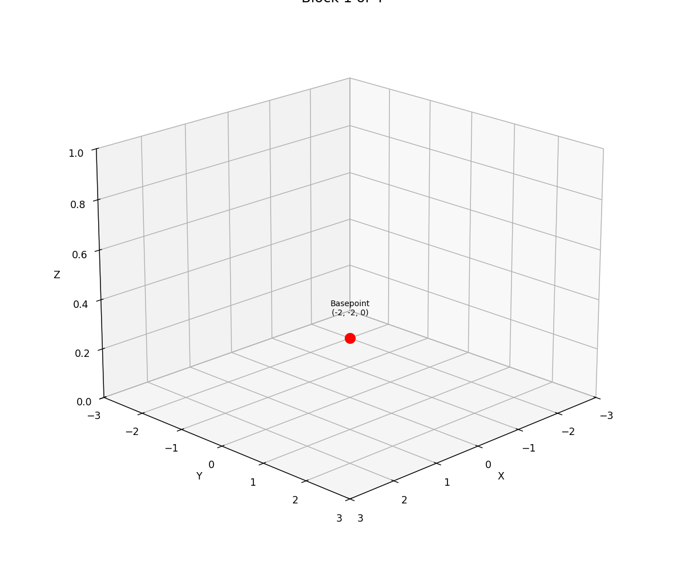

# cap3d_view

A Python tool for visualizing 3D geometry and block construction from CAP3D files generated by the RWCap tool (for calculating capacitances of 3-D structures). This project provides both static 3D visualization and an animation of block construction to help understand the geometry described in .cap3d files.

**Citation:**
RWCap-v4: floating Random Walk based Capacitance solver for conductor structures. Version 4 released. [2023] (Numerical methods for big data / design automation) Group

## Block Construction Animation
The animation below (generated by `block_animation.py`) shows how each block is built step by step from its basepoint and vectors:



## Features

- Parses CAP3D files containing definitions for mediums and conductors in 3D space.
- Visualizes the geometry using matplotlib's 3D plotting capabilities.
- Supports slicing the visualization at a given z-height.
- Highlights conductors and mediums with different colors and transparencies.

## Requirements

- Python 3.7+
- numpy
- matplotlib

Install dependencies with:

```bash
pip install numpy matplotlib
```

## Usage

1. Place your `.cap3d` file in the project directory (e.g., `smallcaseD.cap3d`).
2. Run the script:
   ```bash
   python cap3d_view.py
   ```
3. The script will display two plots:
   - A full 3D visualization of all mediums and conductors.
   - A sliced view showing only objects below `z < 2.0`.

## CAP3D File Format

A CAP3D file contains sections for mediums, conductors, and a window. Each medium or conductor can have one or more blocks, each defined by:

- `basepoint(x, y, z)`: The starting corner of the block.
- `v1(dx, dy, dz)`: Vector defining one edge from the basepoint.
- `v2(dx, dy, dz)`: Vector defining another edge from the basepoint.
- `hvector(dx, dy, dz)`: Vector for the block's height/thickness.

Example block:

```
<block>
    name block1
    basepoint(-2, -2, 0)
    v1(4, 0, 0)
    v2(0, 4, 0)
    hvector(0, 0, 0.3)
</block>
```

## How it works

- The script parses the CAP3D file, extracting all mediums and conductors and their blocks.
- Each block is converted into a 3D box using its basepoint and vectors.
- Boxes are sorted and drawn in 3D, with mediums shown as transparent and conductors as opaque.
- Optionally, you can visualize only the part of the geometry below a certain z-height.

## Customization

- To visualize a different CAP3D file, change the `cap3d_file` variable in `cap3d_view.py`.
- To change the z-slice, modify the `z_slice` parameter in the `draw_components` function call.

## License

MIT License
